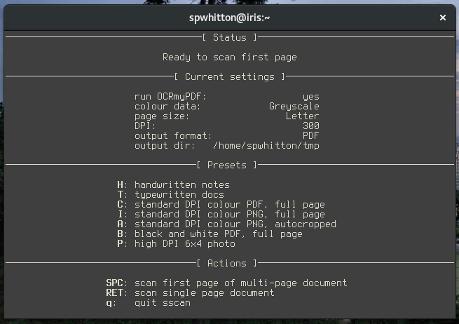

# sscan -- Sean's scanner

## Synopsis

sscan is a UI for scanning multi-page documents using the scanimage(1)
command and a flatbed scanner.

I wrote sscan because I often need to scan multi-page documents on my
GNU/Linux system, and I have only a flatbed scanner, without an ADF.

sscan was originally a crude Python script.  Now it is a somewhat more
robust Haskell program, relying on the [Brick][] library.

[Brick]: https://github.com/jtdaugherty/brick/

## Screenshot



## Installation

1. Ensure that your scanner has [SANE support][].
2. Install prerequisite utilities:
````
apt-get install ocrmypdf pdftk sane-utils haskell-stack imagemagick
````
3. Use [stack][] to build and install sscan:
````
stack --resolver=lts-8.2 install sscan`
````

Note that stack will automatically download and install the various
Haskell dependencies of sscan -- unfortunately, these are not yet
likely to all be installable from your distribution's mirrors.

[SANE support]: http://www.sane-project.org/sane-supported-devices.html
[stack]: https://haskellstack.org/

## Configuration

sscan does not yet have a configuration file.  If it did, this could
be used to configure the available presets, the default settings on
startup, and the output directory.  Patches welcome.

## Usage

Open a terminal, run `sscan` and follow the on-screen instructions.
If you can't see all the key bindings, you will need to increase the
size of your terminal.

## Bugs/patches

By e-mail to `<spwhitton@spwhitton.name>`.

## License

Copyright (C) 2017  Sean Whitton

sscan is free software: you can redistribute it and/or modify it under
the terms of the GNU General Public License as published by the Free
Software Foundation, either version 3 of the License, or (at your
option) any later version.

sscan is distributed in the hope that it will be useful, but WITHOUT
ANY WARRANTY; without even the implied warranty of MERCHANTABILITY or
FITNESS FOR A PARTICULAR PURPOSE.  See the GNU General Public License
for more details.

You should have received a copy of the GNU General Public License
along with sscan.  If not, see
[<http://www.gnu.org/licenses/>](http://www.gnu.org/licenses/).
